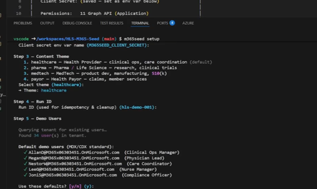

# Health & Life Sciences M365 Seedkit

Populate a Microsoft 365 demo tenant with synthetic Healthcare and Life Sciences content - emails, files, calendar events, Teams channels, chats, SharePoint sites, and Planner boards. minutes.

Built for **Work IQ** demonstrations across four HLS verticals: Health Provider, Pharma/Life Science, MedTech, and Health Payor. All content is synthetic. No real patient data, no PHI.

## What It Seeds

| Content | What gets created | Status |
|---------|-------------------|--------|
| **User Profiles** | jobTitle, department, companyName branded to your theme | GA |
| **Email** | Multi-message threads with clinical attachments | GA |
| **OneDrive Files** | SOPs, discharge plans, compliance docs, quality reports | GA |
| **Calendar** | Recurring meetings with Teams join links | GA |
| **Teams Channels** | Care Updates, Quality Improvement, Nursing Ops, Announcements | Beta* |
| **Teams Chats** | 1:1 and group chats (shift handoffs, discharge planning, staffing) | Beta* |
| **SharePoint Sites** | Clinical Ops Hub, Compliance Portal, Patient Safety Center | GA |
| **Planner** | Sprint boards with buckets and tasks | GA |

*\*Beta modules use Microsoft Graph beta endpoints and require `--enable-beta-teams`.*

All content is theme-aware — switch between `healthcare`, `pharma`, `medtech`, or `payor` and every module adapts.

## Getting Started

You need [VS Code](https://code.visualstudio.com/) (with the [Dev Containers extension](https://marketplace.visualstudio.com/items?itemName=ms-vscode-remote.remote-containers)) or [GitHub Codespaces](https://github.com/features/codespaces), and a Microsoft 365 demo tenant. The project is designed to run entirely inside the included dev container — no local Python or dependency setup required.

> **Tenant permissions:** The setup wizard can auto-create an Entra ID app registration for you, but this requires **Global Administrator** access to the demo tenant. The app uses Microsoft Graph application permissions (e.g., `Mail.Send`, `Files.ReadWrite.All`, `Calendars.ReadWrite`). See [docs/REFERENCE.md](docs/REFERENCE.md) for the full permissions table. This tool is intended for demo/dev tenants only — do not run against production.

**1. Open in Dev Container**

```
Ctrl+Shift+P  →  "Dev Containers: Reopen in Container"
```

The container builds with Python 3.12, Azure CLI, and all dependencies. No local installs.

**2. Run Setup**

```bash
m365seed setup
```

The wizard handles everything: tenant connection, app registration (auto-creates via Azure CLI), theme selection, user discovery, and config generation. It produces a `seed-config.yaml` tailored to your tenant.



**3. Seed**

```bash
m365seed seed-all --dry-run   # preview what will be created
m365seed seed-all             # seed the tenant
```

**4. Cleanup** (when you're done)

```bash
m365seed cleanup
```

Removes all seeded content. Every item is tagged with a `run_id` so cleanup is precise.

---

## Optional: Environment Variables

If you already have an Entra ID app registration, set these **before** opening the dev container — they get forwarded automatically:

```bash
export M365SEED_CLIENT_SECRET="your-client-secret"   # required
export M365SEED_TENANT_ID="your-tenant-guid"          # optional — wizard prompts
export M365SEED_CLIENT_ID="your-app-client-id"        # optional — wizard prompts
```

If you don't have an app registration, the setup wizard offers to create one for you.

## Optional: Run Individual Seeders

You don't have to seed everything. Run modules individually:

```bash
m365seed seed-profiles          # brand user profiles
m365seed seed-mail              # email threads
m365seed seed-files             # OneDrive documents
m365seed seed-calendar          # calendar events
m365seed seed-teams             # Teams channels (requires --enable-beta-teams)
m365seed seed-chats             # Teams chats (requires --enable-beta-teams)
m365seed seed-sharepoint        # SharePoint sites + pages
m365seed seed-planner           # Planner plans + tasks
```

Use `--dry-run` on any command to preview without making changes.

## Optional: Manual App Registration

If you prefer to register the app manually instead of using the wizard:

1. Go to [Azure Portal → Entra ID → App registrations](https://portal.azure.com/#view/Microsoft_AAD_RegisteredApps/ApplicationsListBlade)
2. Create a **single-tenant** app, note the client ID and tenant ID
3. Create a client secret
4. Add the required Graph permissions and grant admin consent

See [docs/REFERENCE.md](docs/REFERENCE.md) for the full permissions table.

---

## Troubleshooting & Reference

For Graph permissions, idempotency details, cleanup flags, known issues, and configuration reference, see **[docs/REFERENCE.md](docs/REFERENCE.md)**.

---

## Development

```bash
pytest -v                                          # run tests
pytest --cov=m365seed --cov-report=term-missing    # with coverage
```

## License

MIT — See [LICENSE](LICENSE).

> All content is synthetic and intended solely for demo environments. No real patient data, no PHI, no PII.
